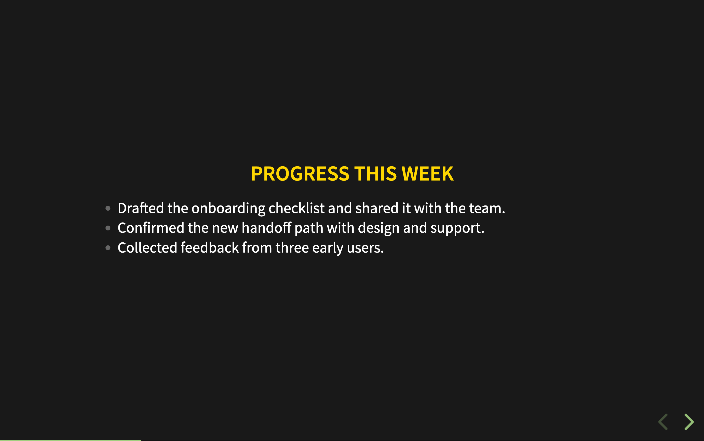
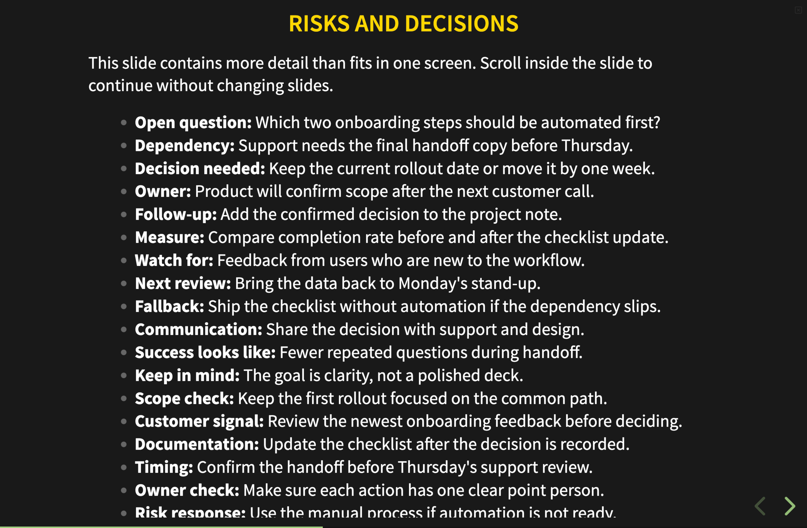
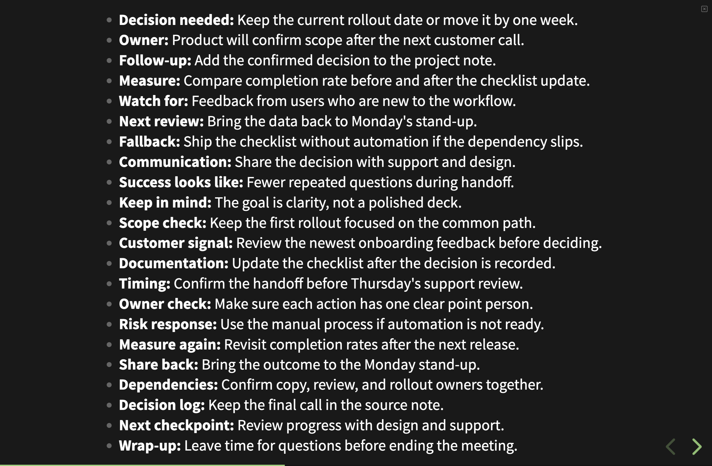
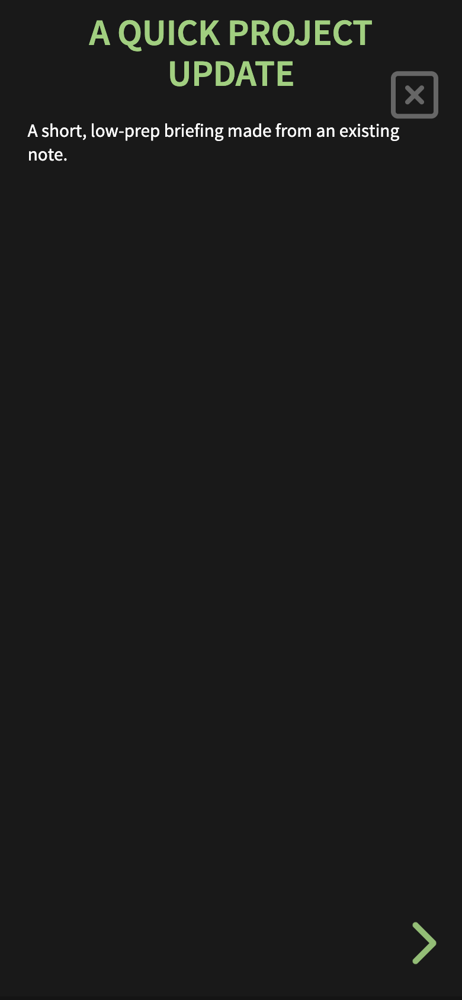
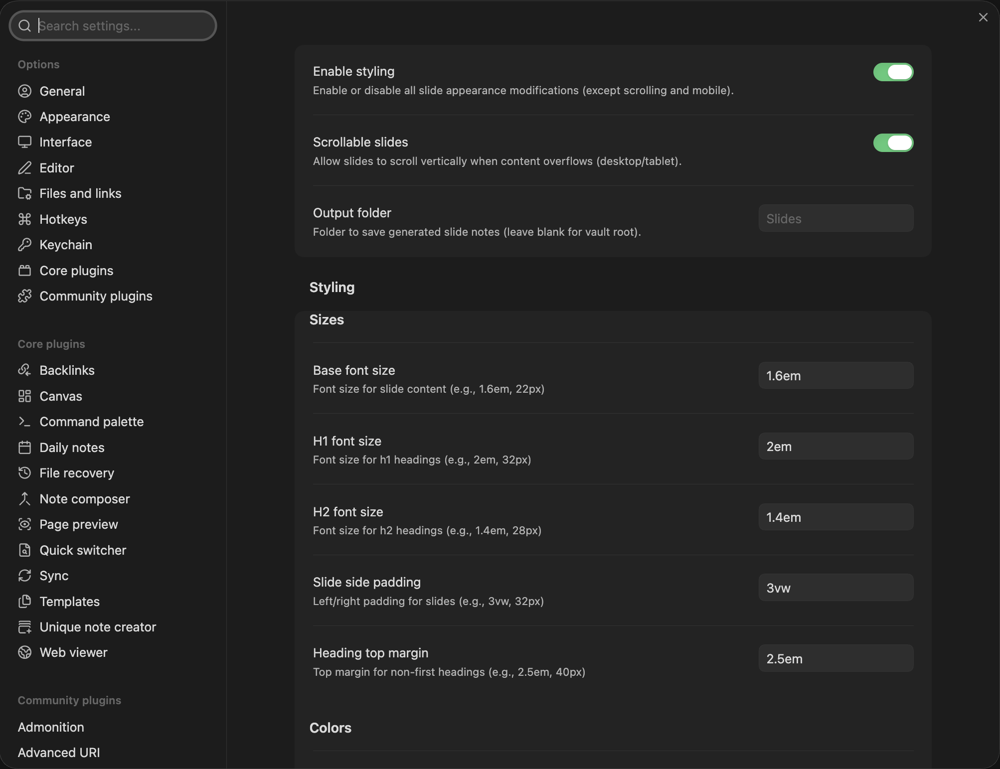

# Snap Slides

**Quick, low-prep presentations from the notes you already have.**

Snap Slides is for meetings, stand-ups, demos, planning sessions, and other moments when you need to put information on screen and talk it through without first building a polished deck. It is intentionally lightweight: keep your notes, make a quick presentation copy if you want slide breaks, and present with Obsidian's built-in Slides core plugin.

The idea is inspired by Evernote's old Presentation Mode—a handy way to share information quickly, rather than spend time making a professional, highly polished slide deck.

## Make a quick presentation

Choose whichever approach fits the moment:

- **Create a new note with slide breaks:** Open the command palette and run **Create slide copy for presentation**. Snap Slides makes a separate note and inserts slide breaks (`---`) before H1 and H2 headings, except before the first heading. Your original note is never changed.
- **Present your existing note:** Open the note and present it directly with Obsidian's built-in Slides core plugin. Enable **Scrollable slides** in Snap Slides settings if the content may overflow. No copy or extra note prep is needed.

## What Snap Slides adds

- Optional styling for headings, colors, font sizes, padding, and heading spacing.
- Scrollable slides for content that doesn't fit on one screen.
- Mobile-specific portrait and landscape font sizes, safe-area spacing, optional vertical centering in either orientation, and scrolling that starts oversized slides at the top.
- A mobile close button that fades when idle and reappears on interaction.
- A configurable folder for presentation copies.

The defaults are ready to use; customization is optional.

## Screenshots

**Slide breaks from headings:** the presentation copy adds separators before H1 and H2 headings without changing the source note.



**Scrollable slides:** overflowing content stays on the same slide as you scroll.





**Mobile presentation:** portrait sizing and the close control adapt to a narrow screen.



**Quick settings:** common presentation options are available from the Snap Slides settings tab.



## Settings

- **Enable styling** to toggle appearance changes independently of scrolling and mobile behavior.
- **Scrollable slides** to allow desktop slides to scroll when content overflows.
- **Output folder** to choose where generated copies are saved (the vault root by default).
- **Font sizes, slide padding, heading margin, and colors** to adjust presentation appearance. The accent color follows Obsidian's theme by default, can be overridden, and can be reset to the theme color.
- **Mobile options** for portrait/landscape font sizes, scrolling, vertical centering, and styling.

## Notes and limitations

- Snap Slides is designed to work with Obsidian's built-in Slides core plugin. Themes, snippets, or custom presentation setups may override its styling.
- The first H1 or H2 heading in a note does not receive extra top margin; subsequent headings do.
- Mobile safe-area spacing helps keep content clear of screen cutouts and notches.

## Contributing

PRs are welcome. Please open an issue or discussion for feature requests and bug reports.

### Development

Requires Node.js 22 or later.

```sh
npm ci
npm run dev
```

Run `npm run verify` before submitting changes to lint, typecheck, and create a production bundle. GitHub Actions runs these checks and the Obsidian community scanner for pull requests and pushes to `main`, then uploads a plugin ZIP artifact. Pushing a tag builds the plugin, generates provenance attestations for `main.js` and `styles.css`, and creates a draft release with the supported plugin files.

## License

MIT
